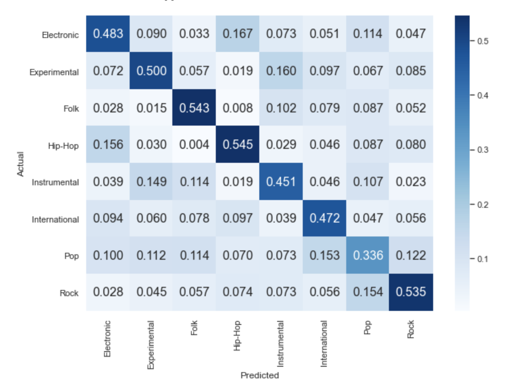

# Final Project 
## Course - CS 418 (Introduction to Data Science)
## Term - Fall 2020

## Team - 
- Saurabh Sangwan
- Rakshitha Jayarame Gowda
- Keshvi Srivastava

## Topic - Music Genre Classification and Similarity Identification

### 1. Introduction
In this project we aim to compare machine learning algorithms in their ability to automatically classify a musical genre to a song clip/snippet. We will also use clustering techniques to analyze the similarities between different genres.

We have gathered 30 second audio clips which will be used to extract audio features such as spectral and rhyhtm features. We will also be using clustering to identify overlapping of genres which more often than usual make it difficult to classify songs into their respective genres.

### 2. Dataset
The dataset we used is **FMA : a dataset for music analysis**[1]. The original dataset has 106,574 tracks. For our project we used a small version of this dataset which has 8,000 tracks of 30 seconds each, these tracks categorise into 8 balanced genres. 
In addition to these audio tracks, it also has per track metadata such as ID, title, artist, genres, tags and play counts, for all 106,574 tracks.

### 3. Feature Selection
Machine learning typically requires each data example to be represented numerically, often as a vector of relevant information 
or ‘feature vector. For this, we used librosa[2] -  a python package for music and audio analysis to extract features from the audio clips. This data includes information about the sound frequencies, bandwidth and rhythm. 

The following features were extracted from the audio clip for each song.

#### 3.1. MFCCs (timbral texture feature) - 

In sound processing, the mel-frequency cepstrum (MFC) is a representation of the short-term power spectrum of a sound. 
While Mel-frequency cepstral coefficients (MFCCs) are coefficients that collectively make up an MFC.
MFCCs are used in music genre classification to detect timbre , 
which can be defined as the ‘quality’ or ‘colour’ of a sound.
For this project, we extracted 20 MFCCs and further took their average across 
the MFCC sequence for each MFCC.

#### 3.2. Zero Crossing Rate (timbral texture feature) - 

The ZCR of a signal is defined as the rate at which a signal changes from pos- itive to negative or negative to positive.
In the context of audio, this refers to the number of times the amplitude of the signal passes through a value of zero, within a given time interval.
Like MFCCs, ZCR is another feature that can be used to understand the timbre of an audio file.

#### 3.3. Chroma Features (pitch content feature) -
Chroma-based features concern the musical notes that are played throughout a song.
For our project we extracted different chroma based features across 12 chroma bins and took their average - 

- chroma_cqt - Constant-Q chromagram
- chroma_cens - Computes the chroma variant “Chroma Energy Normalized” (CENS)
- chroma_stft - Compute a chromagram from a waveform or power spectrogram.

#### 3.4. Spectral Spread (timbral texture feature) - 
Spectral low-level features aim at describing the structure of
(frame or) sound spectra using a single quantity.
Different spectral features extracted - 

- Spectral Centroid (spectral_centroid)
- Spectral Bandwidth (spectral_bandwidth)
- Spectral Contrast (spectral_contrast)
- Spectral roll-off frequency (spectral_rolloff)

#### 3.5. Other Features -

- rms - root-mean-square value for each frame, either from the audio samples.
- tonal centroid features - tonnetz.

Note - Values for feature extraction 

    1.  Sampling rate(the number of samples per second of audio) - 22050 Hz. 
    2.  Hop length (number of samples between successive frames for different features) - 512.
    3.  Frame Length (Length of the frame over which to compute different features) - 2048.

### 4. Data Exploration

#### 4.1 Introduction

The data set has 77 total number of variables. The distribution of the data types are as below:

* There are no missing values in the data
* Percentage Boolean False Counts for each variables is as low as 0.01
* There are 8 classes with 1000 data, hence equally distributed. The below graph shows the pictorial representation of class distribution

#### 4.2 Feature Analysis

We compared genres/classes by their average value for different features. Following are the comparision graphs for MFCC1 and MFCC2. We can see that 'Instrumental' class has either significantly lower or higher average values than the rest for these features. This might explain why our algorithms performed better while classifying this particular class in comparison to several others.

#### 4.3 Data splitting

The variables ['genre','title','track_id'] are dropped from the dataset. Since the title, genre or the track ID do not have any effects on the classification or clustering.
The rest of the variables are used for further analysis and the column "genre" is used as the class lables which is 8. The dataset is standardized with StandardScaler function. 

### 5. Classification Algorithms

#### 5.1 Support-Vector Machine

##### 5.1.1 Parameter Tuning

The support-vector machine was implemented with SVC from sklearn.svm. We used cross validation to test different parameters. Parameters tested - 

1. Kernel - The kernel type determines the way in which the decision boundary of a SVM is drawn. We tested several different kernel types including 'rbf', 'linear' and 'polynomial'. Our initial testing revealed that 'rbf' (radial basis function) was the most successful kernel.
2. C - The C parameter tells the SVM optimization how much you want to avoid misclassifying each training example. For large values of C, the optimization will choose a smaller-margin hyperplane if that hyperplane does a better job of getting all the training points classified correctly. Conversely, a very small value of C will cause the optimizer to look for a larger-margin separating hyperplane, even if that hyperplane misclassifies more points. Several values of C were tested.
3. Degree - For polynomial kernels, we tested several different values in the range [2,5].

The following image shows the highest cross-validation score achieved for different kernel types - 

##### 5.1.2 Results - 

We picked our best 'rbf' kernel model with C=5, to classify our test data. We achieved an accuracy of 53.25%. Following is the confusion matrix of our classification task.

##### 5.1.3 Feature Analysis - 

Next, we did some feature analysis using the '**SelectKBest**' function of the sklearn.feature_selection module. We used it to filter out the features which were least relevant to our classification task, based on their score. We used 'f_classif' as our score function as we had continous values for our features, this leads to the computation of F-values of the features.

We experimented with differerent number of features with our best model, but were not able to improve on the existing accuracy. For instance, with 35 top features, we were able to achieve 49.5% accuracy. Following is the confusion matrix of our classification task using 35 top features. 

#### 5.2 Random Forest

Random forest is a form of ensemble learning, meaning that it combines models with the aim of producing a model that is better than any of the individual models by itself. Also is a meta estimator that fits a number of decision tree classifiers on various sub-samples of the dataset and uses averaging to improve the predictive accuracy and control over-fitting.

##### 5.2.1 Parameter Tuning

The RandomForestClassifier from sklearn.ensemble was used for the random forest. We used cross validation to test different parameters.

1. criterion : The function to measure the quality of a split. Supported criteria are “gini” for the Gini impurity and “entropy” for the information gain. The test gave better performance with "gini"

2. n_estimators: This decides the number of trees in the forest. Even though the accuracy increases with increase in the tree count, 400 count gave the best results with random state = 1 

Parameter variations

1. max_samples - The number of samples to draw from X to train each base estimator. sample_size = [1000,2000,3000,4000,5000,6000] this gave an increase in accuracy as the count of the max samples increases. Except for 5000 samples which might be due to the other parameter constraints and type of data selected. 
Below graph shows the variations of accuracy against the increase in maximun samples 

2. max_leaf_nodes - Grow trees with max_leaf_nodes in best-first fashion. Best nodes are defined as relative reduction in impurity. max_leaf_nodes = [200,400,600,800,1000,1200] this gave an increase in accuracy as the count of the maximun leaf node increases. 
Below graph shows the variations of accuracy against the increase in maximun leaf nodes 

3. max_features - The number of features to consider when looking for the best split. max_features = [10,20,30,40,50,60,70] this resulted in different accuries for varied number of features. The model gives the best accuracy when the count of features to split is 20. 
Below graph shows the variations of accuracy against the increase in the number of features.

##### 5.2.2 Results

We picked our best 'gini' model with n_estimators = 400, to classify our test data. We achieved an accuracy of 49.12%. Following is the confusion matrix of our classification task.

##### 5.2.3 Top features 

The below values shows the top features used in the model training. 
Feature ranking:

0. feature 36 (0.025757)
1. feature 57 (0.025126)
2. feature 60 (0.023938)
3. feature 61 (0.023540)
4. feature 63 (0.023112)
5. feature 66 (0.022981)
6. feature 38 (0.022482)
7. feature 58 (0.021857)
8. feature 62 (0.020815)
9. feature 37 (0.019751)
10. feature 56 (0.019747)

#### 5.3 Evaluation

Overall, SVM was our best performing model for classification. For both SVM and Random Forest, we tried feature selection by selecting top-k features, but were unable to improve on our existing accuracy. The maximum accuracy achieved was 53.25%, which is almost 4.5x of random accuracy of 12.5%. 

The genre accuracy scores for our best performing model are - 

- Hip-Hop - 61.7%
- Instrumental - 51.6%
- Rock - 61.9%
- Folk - 59.7%
- Electronic - 45.8%
- International - 59.6%
- Pop - 39.1%
- Experimental - 44.9%

### 6. Clustering Inferences

One of the our interesting research was to identify overlapping of genres. We approached this problem using Clustering. We analysed which features that would contirbute to the model and in hand identify which genres would overlap or disappear altogether.

To begin with, we identified the important features from their F-score. Two of the most informative features were chroma_cens and chroma_cqt. For our study we calculated the averaged values of various features such as - chroma_cens_avg, chroma_cqt_avg, chroma_stft_avg, and spectral_contrast_avg. We then checked the correleation between different features. From this study we analysed which mfcc features could be dropped to satisfy model assumptions of no collinearity between the features. After this pre processing, we fed the data to our K-means model and analysed which features stood out, overlapped and/or dissappeared.

#### 6.1 Feature Selection:

Our above tables on F-score helps identify the important features to be considered. Apart from this, we also need to identify the relation between the features. To do so we check the correlation between all features. While, most were non-related a few stood out with a pearson correlation coefficient greater than 0.3. which we dropped. These included - ['mfcc7', 'mfcc5', 'mfcc19', 'mfcc3', 'mfcc4']. The correlation table is given as below:

#### 6.2 Studying the cluster features:

We analysed how many clusters were actually required for the data itself. We checked the SSE value for various number of clusters ( the data ideally should move towards 8 clusters as we have 8 balanced genres ). We plot the SSE value against the number of clusters and get the following plot:

The plot shows that having 8 clusters definitey minimises our error. Which is exactly as it would because there are 8 possible clusters (genre) to categorise our data into. We also compared the sillhoette coeffficient against the number of clusters as shown below. Again, the silhouette coefficient is seen to be the lowest at the higher cluster values (k=8). This means our data is clustering correctly or very close to its ideal value.

#### 6.3 Cluster Confusion Matrix:

Our most interesting study was to see how some genres may be completely overshadowed by their counterparts. We observed this when plotting the confusion matrix of our clustering model. As one can see, the value for Electronic, Experimental and International was zero. This would mean that all songs classified into these genres can easily be represented in other genres too, maybe even more correctly. This would constitute to our theory of overlapping genres which is what makes music genre classification a very difficult task generally.

#### 6.4 Conclusion:

It is very interesting to note how clustering can help identify special cases even when not used for the purpose of classification specifically. Our k-means model if used for identifying which cluster test data may fall into is definitely not a good model. It gives an accuracy of approximately 7%, which although better than random case probability, is much lower than our above classification models. However, our k-means model helps identify various other parts of the genre classification. Using clustering, we were able to identify which genres may overlap and overshadow the others. It would also help to note that there are more features which may help in improving the clustering of these overlapped genres. Features such as danceability, pitch, etc can also help but were not used here due to unavailability for the studied tracks.

### Conclusion and Future Work

Performance varied with different models but we observed some similar trends. E.g. across all classification results pop was the misclassified more than any other genre by around 15-20%. In classification, we observed how there were no true clusters for Electronic, Experimental and International genres, this may explain why the accuracy fo 'Electronic' and 'Experimental' classes was below average accuracy but 'International' class performed well there. 

We also had some other features available to us which included 'danceability', 'pitch', etc from Echonest(now known as Spotify), but we were unable to use them as they were only available for roughly 1300 of the 8000 tracks in our dataset. In the future we can explore how these features affect our classification approach. Also, it will be good to use some advanced deep learning models for the classification task. 

### References
1. https://www.loc.gov/item/2018655052
2. https://medium.com/latinxinai/discovering-descriptive-music-genres-using-k-means-clustering-d19bdea5e443
3. https://towardsdatascience.com/discovering-similarities-across-my-spotify-music-using-data-clustering-and-visualization-52b58e6f547b
4. https://towardsdatascience.com/a-feature-selection-tool-for-machine-learning-in-python-b64dd23710f0
